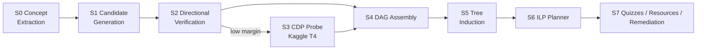

# LightGAP — Architecture Spec

Read `00_ANTIGRAVITY_BUILD_BRIEF.md` first. This file is the stage-by-stage build spec for a fresh repository — every stage below is new code, even where the underlying method (S2, S4, S6) is a reproduction of an already-validated approach rather than a novel one.

## Pipeline overview



## Why this design looks the way it does

Three things learned from an earlier attempt at this same project shape every choice below, worth keeping in mind while building rather than re-discovering the hard way:

1. **Asking an LLM to invent curriculum structure directly produces generic output**, no matter how good the prompt is — a language model asked for "a curriculum for X" returns something close to the average curriculum in its training distribution. S0 and S5 below extract and name things with an LLM; nothing decides structure with one.
2. **A directional scorer is not the bottleneck a naive read of "improve the model" would suggest.** A well-built LR baseline on asymmetric embedding features gets direction right on nearly every deliberately-reversed test pair; its recall problem traces back almost entirely to never being shown the right candidate pairs in the first place. That's why S1 (candidate generation) exists as its own stage with its own gate, rather than being folded into S2's scoring.
3. **A hierarchical mind-map UI is easy to accidentally hard-code into a fixed number of levels** (e.g. "always 4-6 modules, each with 2-4 subtopics") — which then caps every domain at the same generic shape regardless of its actual dependency structure. S5's depth comes from the DAG itself (longest prerequisite chain), not from a schema.

## Schema contract, decided from the start

Don't let node depth be a fixed enum (`root`/`module`/`subtopic`) anywhere in the wire contract — that's exactly the mistake described above, just moved into the API layer instead of the prompt. Use:

```python
NodeTypeLiteral = Literal["root", "branch", "leaf"]  # branch = any non-leaf, non-root node

class ConceptNodeOut(BaseModel):
    id: str
    label: str
    node_type: NodeTypeLiteral
    depth: int               # computed by S5, longest-path layer, arbitrary range
    status: NodeStatusLiteral
    parent_id: Optional[str]
    cluster_id: Optional[str]
    ...
```

Build the in-memory graph model (`GraphModel` / `ConceptNode` dataclasses) with `depth: int` and `cluster_id: Optional[str]` as first-class fields from the start, so nothing downstream has to retrofit arbitrary-depth support later.

---

## S0 — Concept extraction

**Input:** a goal concept string.
**Output:** a set of `concepts` rows (canonical name, definition, source document, source span) scoped to a `domain`.

**See `06_S0_S6_HARDENING.md` for the canonicalization details this section originally under-specified — read it alongside this section, not instead of it.**

**Build** `backend/app/services/module0/`:
- `harvest.py` — pulls source documents: Wikipedia category subtree + lead sections for the goal concept (Wikipedia API, no key needed), plus the AL-CPL corpus text for any of its four domains (data mining, geometry, physics, precalculus) if the goal concept overlaps one of them. **See `07_S1_SIGNAL_HARDENING.md` Part A — add a syllabus/course-outline harvest query alongside this, not instead of it; Wikipedia alone starves the `s_order` signal below.**
- `extract.py` — noun-phrase chunking (spaCy) over harvested documents, plus one Groq call per document batch: *"List the concepts this section introduces, one per line, with the exact span of text that defines each."* This is extracting mentions from text the model can already see, not a structural decision, so it's fine per the governing principle in `00_ANTIGRAVITY_BUILD_BRIEF.md`.
- `canonicalize.py` — dedupe extracted surface forms by MiniLM cosine similarity plus an alias table, producing the final `concepts` rows.

**Target scale:** 60–100 concepts per domain, per the paper. If a goal concept harvests far more, cap by relevance (cosine similarity of each candidate's definition to the goal concept's own definition) rather than truncating arbitrarily.

**Persist:** insert into `concepts`, `concept_aliases`, `corpus_documents` (see `02_DATABASE_SUPABASE_SPEC.md`).

---

## S1 — Multi-signal candidate generation

**The highest-value stage in this build.** This is the piece the earlier attempt never implemented at all, and the earlier attempt's own audit found that most of its prerequisite-recall loss traced back to exactly this gap, not to the scorer.

**Input:** `concepts` for a domain.
**Output:** `candidate_edges` rows, one per ordered pair that survives pruning, each carrying four raw signal scores plus a combined `s_corr`.

**Build** `backend/app/services/module1/candidate_gen.py` with four deterministic, no-model-call signals, plus a fifth added later — see `07_S1_SIGNAL_HARDENING.md` Part B for `s_llm_plaus`, which fills a gap none of the four below can:

| Signal | Computation | Notes |
|---|---|---|
| `s_order` | fraction of source documents where A's span precedes B's span, over documents containing both | directionally asymmetric |
| `s_defmention` | does `definition(B)` reference A (by canonical name or alias)? weighted by position | strongest single cue in the literature |
| `s_cooc` | normalized PMI of A, B within the same paragraph/section | recall-oriented |
| `s_sim` | MiniLM cosine, **pruning only** — discard pairs below a low floor, never use to score direction | similarity has no directional information; don't let it leak into `s_corr`'s weighting as if it did |

Combine into `s_corr` via a weighted average (weights are a free hyperparameter — grid search on AL-CPL cross-validation, never on gold). Admit any pair above a deliberately low threshold; this stage is tuned for recall, precision is S2's job.

**Gate before proceeding (P2 in the build brief):** candidate recall on `gold_pairs.csv` ≥ 0.95. Of the 64 true-prerequisite rows in gold, what fraction appear as a `candidate_edges` row in either direction (direction is S2's job, not S1's)? Write this as `docs/results/eval_candidate_recall_<date>.md` per `05_TESTING_RESULTS_PROTOCOL.md`. This is a diagnostic on S1 only, not a `final_eval` row in the leakage-guarded table — see `02_DATABASE_SUPABASE_SPEC.md` for why that distinction matters.

---

## S2 — Directional verification

**Input:** `candidate_edges`.
**Output:** `edge_scores` rows: `s_lr_forward`, `s_lr_reverse`, `margin = |forward - reverse|`, `s_fused` (initially just the LR score; S3 adds a term later).

**Build** `backend/app/services/module1/`:
- `embed.py` — wraps `all-MiniLM-L6-v2`.
- `score_pairs.py` — implements `f_dir(u,v)` and the logistic regression, per the methodology spec in `00_ANTIGRAVITY_BUILD_BRIEF.md`.
- `calibration.py` — Youden's J cross-validation on AL-CPL, graph-aware split, freeze-once protocol.
- `verify.py` — for each candidate pair, score both orientations, keep the higher-scoring direction if it clears the frozen `tau_edge`, store the margin regardless of admission. Low-margin pairs (bottom quartile) are the ones flagged for S3.

---

## S3 — Counterfactual Dependency Probing (CDP)

Runs on Kaggle, not locally or in the request path — full spec in `03_KAGGLE_FINETUNE_PIPELINE.md`. Implements the paper's Equation 1 as an actual teacher-forced perplexity measurement — not a word-count or explanation-length proxy, and not achievable through most hosted inference APIs, since they generally don't expose token log-probabilities. What S3 needs from the rest of the app:

- A work queue: `edge_scores` rows in the bottom margin quartile with `d_cdp IS NULL` (indexed — see `02_DATABASE_SUPABASE_SPEC.md`).
- A reference explanation per concept to teacher-force against — use the `concepts.definition` text from S0, expanded via one Groq call if the raw definition is too short to be a meaningful teacher-forcing target.
- An ingestion path (`scripts/kaggle_ingest.py`) that writes `d_cdp` back into `edge_scores` and updates `s_fused = α·s_corr + β·s_lr + γ·norm(d_cdp)`, with `α, β, γ` calibrated on AL-CPL CV and frozen — same protocol as `tau_edge`.

If a pair's margin is high enough that S2 already resolved it confidently, S3 never runs for that pair, and `s_fused` drops the γ term (renormalize the remaining weights).

---

## S4 — Graph assembly

**Input:** admitted `edge_scores` for a domain.
**Output:** an immutable `graph_snapshots` row plus its `dag_edges`.

**Build** `backend/app/services/module2/build_graph.py`: threshold filter at `tau_edge` → Tarjan's SCC to detect and prune cycles (drop the lowest-confidence edge in each cycle) → `networkx.transitive_reduction` to remove redundant hops. Persist every dropped edge with a `dropped_reason` (`threshold` / `cycle_prune` / `transitive`), not just the survivors — this is what makes a collateral-damage audit (does a true prerequisite pair survive as a direct edge? if not, why?) queryable against a live snapshot instead of requiring a one-off script.

---

## S5 — Tree induction

**The other stage that didn't exist before, and the one that actually produces the mind map.**

**Input:** a `graph_snapshots` DAG.
**Output:** `tree_paths` (closure table, arbitrary depth) and `clusters` (with LLM-authored labels).

**Build** `backend/app/services/module5/induce_tree.py`:
1. **Depth from the DAG:** longest-path layering — a concept's depth is the length of the longest prerequisite chain beneath it (`networkx.dag_longest_path_length` per subgraph, or a topological DP). This is what makes depth vary naturally by subject instead of being fixed.
2. **Grouping from structure:** Leiden community detection (`python-igraph` or `leidenalg`) over the undirected projection of the DAG, edge-weighted by `s_fused`. Concepts that densely depend on each other land in the same cluster.
3. **Naming only from an LLM:** one Groq call per cluster — *"Given these concepts and definitions, write a 2-4 word label for this group."* Naming a set you hand the model is a labelling task; deciding the set was step 2's job.

Write `tree_paths` and `clusters`, and set each `concepts` row's `depth` / `cluster_id` for the snapshot.

---

## S6 — Path planning

**Input:** a `graph_snapshots` DAG, a learner's mastery vector, a goal node, a time budget.
**Output:** an ordered study path.

**Build** `backend/app/services/module2/path_optimizer.py`: a precedence-constrained knapsack, solved with `scipy.optimize.milp` — maximize coverage of unmastered ancestors of the goal node subject to the time budget, respecting the DAG's precedence constraints.

**"Coverage" is underspecified as written — it doesn't say every ancestor is worth the same, and a naive implementation will fill the budget with whatever's cheap rather than what's pedagogically load-bearing. See `06_S0_S6_HARDENING.md` Part B for the actual objective function to implement: build it from there, not from "coverage" alone.**

---

## S7 — Resources, quizzes, remediation

**Build** `backend/app/services/module3/` (content aggregation, diagnostic quizzes) and `module4/` (decay tracking, remediation graph rewriting).

- **Resource queries** are built from `(concept.title, cluster.label, concept.definition)` against real search APIs (YouTube Data API, arXiv API, GitHub search) — never hardcode a fixed list of videos/repos keyed on keyword matches. That shortcut is a smaller version of the same mistake S0/S5 avoid: it lets a handful of hand-picked defaults stand in for something that was supposed to be derived per node.
- **Quiz generation** — one Groq call per node: a stem, the correct answer, a "prerequisite distractor" (a plausible-sounding statement that reveals the learner is missing a specific upstream concept), and a "conceptual distractor," each tagged with a misconception ID.
- **Decay + remediation** — SM-2 or FSRS-style memory decay per concept; when a learner's wrong answers reveal a specific misconception rather than a plain gap, insert a remediation node targeting it and re-plan (S6) around the updated graph.

---

## Orchestration

Build `backend/app/services/pipeline.py` as a single orchestrator that calls S0→S1→S2→(S3 async via the Kaggle queue)→S4→S5→S6 in order and persists a `graph_snapshots` row at the end. The `/graph` router endpoint calls this orchestrator and returns its result. If any stage raises, the endpoint returns an error to the frontend — there is no fallback branch, and there should never be one added later as a "just in case." A curriculum the pipeline didn't actually derive must never be served as if it were one.